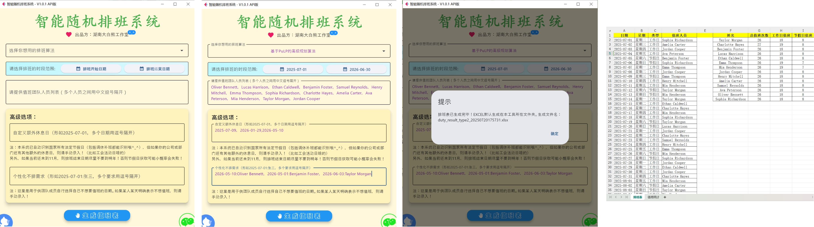

# Smart_Scheduling_Duty_System
# 智能随机排班系统

## Author
[HnBigVolibear 湖南大白熊工作室](https://github.com/HnBigVolibear)

## Version
V1.0.1 API版



## Description
This is a smart scheduling duty system that can generate a duty schedule for a given period of time based on the number of employees. This system can also take into account the availability of employees and holidays, and can generate a schedule that meets the requirements of the user.

The whole holidays list is provided by the API from [@提莫的神秘小站](https://timor.tech/api/holiday)
Maybe you can get the holidays list from the "chinese_calendar" module in Python, but this module needs to be updated every year, so I choose to use the API. 

本排班系统内置两种动态规划的随机排班算法，会尽可能的让参与排班的团队成员平均分配排班次数，包括节假日排班的次数也会尽可能的平均！
同时，考虑到有时候，部分成员因私事不想在未来某天值班，因此，本系统也支持用户自定义个性化的不排班需求！

This system is built using the Flet framework, which is a Python framework for building cross-platform desktop applications. The system is designed to be easy to use and to provide a user-friendly interface for the user to input the required information and view the generated schedule.

## Features
- Generate a duty schedule for a given period of time based on the number of employees per day
- Take into account the availability of employees and holidays
- Generate a schedule that meets the requirements of the user
- Use the Flet framework to build a user-friendly interface for the user to input the required information and view the generated schedule

## Usage
To use this system, the user needs to input the following information:
- The number of employees
- The start date and end date of the period for which the schedule is to be generated

## Run the desktop app
进入当前项目目录，直接运行以下命令即可：

```
flet run
```

#### 备注：所需依赖环境：

```
pip install -r requirements.txt
```

## Build the app on Windows
注：强烈建议在Python虚拟环境里进行打包！
这里以Vene虚拟环境为例，命令行CMD里运行以下命令打包即可（先进入src目录里）：

```
pyinstaller --windowed --onefile --name "智能随机排班系统" --add-data "../.venv/Lib/site-packages/pulp;pulp" --add-data "assets;assets" main.py --icon bear.ico --noconfirm --clean
```

## 特别鸣谢
@提莫的神秘小站 提供节假日接口数据！
官网：https://timor.tech/api/holiday

## Sponsor Me 捐赠我：

